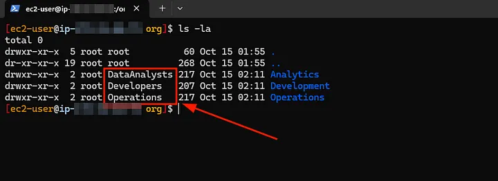

## Introduction

Managing permissions in Linux is a fundamental skill for system administrators, DevOps and alike. In this guide, I will walk through how to create directories, users, and groups.

I will then show you how to manage their permissions to control access and ownership in a multi-user environment.

## Benefits

By the end of this guide, you’ll understand how to:

- Create directories as well as manage users and groups in Linux.
- Set ownership and permissions for improved security.
- Control user access to specific directories and prevent unauthorized access.

---

## Baseline

Before starting, you should have a basic understanding of Linux commands and have access to a terminal with root or sudo privileges.

To follow along effectively, you should use a Linux distribution like: Fedora, Red hat or CentOS

## Scope

I will go over creating directories, users and groups. Assigning users to groups and setting group ownership.

I will also go over how to modify permissions so only group members can access their respective profiles and directories.

## Bonus

If you stick until the end, I will show you how you can automate the entire process using a script.

---

## Setting Up Directories and Groups

I’ll start by creating three directories and 3 groups to manage user access when accessing their respective directories.

### Step 1: Creating Directories

I will run the command below to create three directories: *Development*, *Operations* and *Analytics*.

```bash
sudo mkdir /org/Development /org/Operations /org/Analytics
```

Where exactly you create these files honestly for this demonstration doesn’t matter. However! that being said, in a production environment you should *NEVER* create these in your home folder, which is likely the directory you are in.

A home folder is for your personal files for the currently logged in user. So since these are going to be shared by other users, you don’t want them in your personal folder.

I will create these under the root directory / in a folder called ‘org’, short for organization.

### Step 2 (optional): Creating Blank Dummy Files

For demonstration, I’m going to create some empty files in each directory to simulate data. You may already have files you want to work with and so this step is optional.

```bash
sudo touch /org/Development/dev_file{1..10}.md /org/Operations/ops_file{1..10}.txt /org/Analytics/analyst_file{1..10}
```

> You may have noticed I used this odd looking syntax: {1..10}, this is referred to as a brace expansion and in short helps in creating lists.

So now I have my directories and dummy files created as you can see here in the following screenshot:


### Step 3: Creating Groups

I will then create the three groups to manage access to the directories: *Developers*, *Operations* and *Data Analysts*.

```bash
sudo groupadd Developers
sudo groupadd Operations
sudo groupadd DataAnalysts
```

To confirm they were added successfully, you can cat the /etc/group file to see a list of all the groups. I will use grep to search for the new groups I created by running the following command:

```bash
cat /etc/group | grep 'Developers\|Operations\|DataAnalysts'
```


### Step 4: Assigning Group Ownership to Directories

Now I will assign ownership of each directory to its respective group. The command used to do this chown stands for Change Ownership and allows you to change user owner and group owner of the file/folder in question.

By omitting the user owner we are only changing the group ownership in this case.

```bash
sudo chown :Developers /org/Development
sudo chown :Operations /org/Operations
sudo chown :DataAnalysts /org/Analytics
```

Now as you can see, the group ownership of these directories are currently setup.



We are not yet done though, next we need to move onto giving our users permissions!


---

## Setting Permissions for Groups and Users

Now, I’ll set permissions to restrict access to the directories so that only the assigned group members can access them.

There are 2 ways we can set permissions:

- Symbolic Notation
- Octal Numbers

This is great news if you don’t like to do math.


### Step 1: Modifying Directory Permissions

I need to ensure that only the user and group owners can read, write, and execute in their respective directory.

*The Octal Way*

What are these numbers and what do they mean!?

```bash
sudo chmod -R 770 /org/Development /org/Operations /org/Analytics
```

*The Symbolic Notation Way*

What is this gibberish and what does it mean!?

```bash
sudo chmod -R ug+rwx,o-rwx /org/Development /org/Operations /org/Analytics
```

Let me break this down a bit more as both of these are quite simple to understand at least from a basic level of understanding.

When we are dealing with permissions in Linux each file and folder has different levels of access:

- User Owner
- Group Owner
- Everyone Else

Take a look at my screenshot below so I can explain this a bit better.


There are 10 *file attributes*;

- The first character determines the type, we are only concerned with the 2 most widely used: ‘ d ’ = Directory and ‘ — ’ = File
* Just keep in mind there are more types *
- The next 3 are for the *User Owner*
- The next 3 are for the *Group Owner*
- The last 3 are for *Others* or (Everyone Else)

These last 9 are actually *file modes* and are used for the permissions in the form of Read, Write and Execute or R W X

When using *Octal Numbers* they are referring to the mode we are changing:

R = 4
W = 2
X = 1
No Permission = 0

So 770 translates to
User -> R(4) + W(2) + O(1) = 7
Group -> R(4) + W(2) + O(1) = 7
Others -> No Permissions = 0

When we are using *Symbolic Notation*:

U = User
G = Group
O = Other

One last thing I want to point out before we move on and that is the *-R* flag parameter I used. It stands for Recursive and if you recall from earlier we only affected the Directory ownership.

As you can see from my screenshot, our permissions took affect but I still need to update ownership of the files. I did this on purpose to showcase this.


Applying permissions and ownership in this way is preferable if every file+folder contained within needs to inherit the same criteria.

So using the ownership command from before it would look similar to the chmod now.

```bash
sudo chown -R :Developers /org/Development
sudo chown -R :Operations /org/Operations
sudo chown -R :DataAnalysts /org/Analytics
```


### Step 2: Creating Users and Adding Them to Groups

I will create three users: Jess Waller, Blake Dorsey, and Joey Ewart and assign each user to their respective group.

```bash
sudo useradd -m jwaller -g Developers -c "Jess Waller, email=jwaller@levelupbank.com"
sudo useradd -m bdorsey -g Operations -c "Blake Dorsey, email=bdorsey@levelupbank.com"
sudo useradd -m jewart -g DataAnalysts -c "Joey Ewart, email=jewart@levelupbank.com"
```

I will explain the command above a bit more. I use 3 parameters when creating the users:

- -m = Used to create a home directory for the user
- -g = Used to add user to a specified group, this would be the initial group. If you wanted to also add them to multiple other groups you would also use -G in addition to this
- -c = Used to add a comment string, this gives an optional description that is helpful for others.

Now that our users are created and added to their respective groups we will do a few things:

*Verify the users were actually created*

```bash
sudo cat /etc/passwd | grep 'jwaller\|bdorsey\|jewart'
```


*Verify they are part of the correct group*

```bash
sudo groups jwaller bdorsey jewart
```


*Create passwords for each user*

```bash
sudo passwd jwaller
sudo passwd bdorsey
sudo passwd jewart
```


Okay now that everything is complete, we should be able to login to a user and confirm they are unable to access a directory they don’t have access to.

We run the following command to switch to another user:

```bash
su - jwaller
```

As you can see below I’m unable to change to the *Analytics* or *Operations* directories as I am not a part of those groups and we only allowed the group owners to have access.

Also, you will notice the lack of *sudo* when renaming a file in the directory. This is no longer needed as I have access being part of the group.


To logout we can simply issue the command: *exit*

I will confirm using the other 2 users:

```bash
su - bdorsey
```


```bash
su - jewart
```


### Step 3: Setting User Permissions

We’ll ensure that each user can only access their home directory and cannot view or access other users’ directories.

Now in my distribution, the permissions were actually set up correctly by default and I didn’t have to do anything here. But I will still show you the commands incase your situation is different.

We would change the permissions the same way we did on the directories previously, only this time we only want the user ownership to have full permissions and nothing else!

```bash
sudo chmod 700 /home/jwaller
sudo chmod 700 /home/bdorsey
sudo chmod 700 /home/jewart
```


The group ownership is the group we gave it them initially. However, typically when you omit the group on user creation a default group would be created that is the same name as the username.

This way no one part of a group would be able to access these directories. Since we gave it 1 group only, this group doesn’t exist for any of our users.

But that’s okay! now with your newfound knowledge, you could create that group and assign the users and give the correct permissions.

---


## Bonus — Creating a Script to Automate

As promised, I mentioned I would show you how to automate the process using a script.

To create the script we create a new empty file with the extension .sh

```bash
sudo touch setup.sh
```

We will then edit this file and add the following as the very first line:

```bash
#!/bin/bash
```

While it’s not required, its convention to do so and depending on what version of Linux you are running your script may act funny if you don’t.

It’s just to let the shell know what interpreter to run.

Now we will just add all the previous steps basically into 1 script that we can then run, the cool thing about the script is we can add comments for readability.

```bash
# Create organization folder share
sudo mkdir /org
```
```bash
# Create Department Diresctories
sudo mkdir /org/Development /org/Operations /org/Analytics
```
```bash
# Create some file data to work with in each directory
sudo touch /org/Development/dev_file{1..10}.md /org/Operations/ops_file{1..10}.txt /org/Analytics/analyst_file{1..10}
```
```bash
# Create our department groups
sudo groupadd Developers
sudo groupadd Operations
sudo groupadd DataAnalysts
```
```bash
# Assign group ownership to our directories and files
sudo chown -R :Developers /org/Development
sudo chown -R :Operations /org/Operations
sudo chown -R :DataAnalysts /org/Analytics
```
```bash
# Change permissions so that each group only can Read, Write and Execute files in their respective directories
sudo chmod -R 770 /org/Development /org/Operations /org/Analytics
```
```bash
# Create our users, add their details and add them to their respective groups
sudo useradd -m jwaller -g Developers -c "Jess Waller, email=jwaller@levelupbank.com"
sudo useradd -m bdorsey -g Operations -c "Blake Dorsey, email=bdorsey@levelupbank.com"
sudo useradd -m jewart -g DataAnalysts -c "Joey Ewart, email=jewart@levelupbank.com"
```
```bash
# Create passwords for our new users
sudo passwd jwaller
sudo passwd bdorsey
sudo passwd jewart
```
```bash
# Change home directory permissions
sudo chmod -R 700 /home/jwaller
sudo chmod -R 700 /home/bdorsey
sudo chmod -R 700 /home/jewart
```

I added this extra line to get some output once the script has finished running:

```bash
echo "Setup is now complete! Users, Directories, Groups and Permissions are completed."
```

So the full script completed will look like this:

```bash
#!/bin/bash

# Create organization folder share
sudo mkdir /org

# Create Department Directories
sudo mkdir /org/Development /org/Operations /org/Analytics

# Create some file data to work with in each directory
sudo touch /org/Development/dev_file{1..10}.md /org/Operations/ops_file{1..10}.txt /org/Analytics/analyst_file{1..10}

# Create our department groupssudo groupadd Developers
sudo groupadd Operationssudo groupadd DataAnalysts

# Assign group ownership to our directories and files
sudo chown -R :Developers /org/Developmentsudo chown -R :Operations /org/Operationssudo chown -R :DataAnalysts /org/Analytics

# Change permissions so that each group only can Read, Write and Execute files in their respective directories
sudo chmod -R 770 /org/Development /org/Operations /org/Analytics

# Create our users, add their details and add them to their respective groups
sudo useradd -m jwaller -g Developers -c "Jess Waller, email=jwaller@levelupbank.com"sudo useradd -m bdorsey -g Operations -c "Blake Dorsey, email=bdorsey@levelupbank.com"sudo useradd -m jewart -g DataAnalysts -c "Joey Ewart, email=jewart@levelupbank.com"

# Create passwords for our new users
sudo passwd jwallersudo passwd bdorseysudo passwd jewart

# Change home directory permissions
sudo chmod -R 700 /home/jwallersudo chmod -R 700 /home/bdorseysudo chmod -R 700 /home/jewart

echo "Setup is now complete! Users, Directories, Groups and Permissions are completed."
```

We are almost done, we just need to allow this script to be executable so that we can run it on our system.

To do this, we issue the following command:

```bash
sudo chmod +x setup.sh
```

Now to run the script we just run the command:

```bash
sudo sh setup.sh
```

and watch the magic happen as we sit back and enjoy our cup of coffee ☕

This is just a very basic script, we can create much more advanced ones with functions and calls to other scripts to all sorts of interesting things!

*Conclusion*

By following this guide, you’ve successfully created directories, assigned them to specific groups, created users, and restricted access based on permissions. This setup enhances security by ensuring that only the necessary users can access their files.

You can now also save time by creating simple bash scripts to automate the process!

---

*Thanks for reading!*